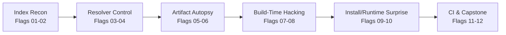
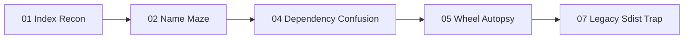

# HKPUG PyPI CTF Flag Lab Plan

Planning snapshot: 2026-06-13

## Concept

This is a 30-day "learn PyPI by hacking it safely" trail, but it should not
have one small flag every day. A better rhythm is 12 substantial flags, with
each flag open for 2 to 3 days.

Each flag should contain enough material to feel like a mini incident:

- a scenario
- a toy package index
- one or more package artifacts
- a victim command or victim app
- a clear fake flag capture objective
- a short defensive explanation

The challenge should be hard enough that participants need to inspect,
experiment, and reason. But once they understand the idea, the actual exploit
path should be short. No stupidly long hiding places, no arbitrary word hunts,
and no trick where the participant loses sight of what they are hacking.

All package behavior is local-only:

- no real PyPI uploads
- no real package names
- no real credentials
- no network exfiltration
- all captured flags are written under `artifacts/`

## Flag Pattern

Official HKPUG flags should be team-specific and derived by the scorer:

```text
HKPUG{<flag_id>.<team_id>.<hmac_prefix>}
```

Community/practice flags can be public:

```text
HKPUG{practice.<flag_id>}
```

## Visual Track Map



## Release Calendar

| Flag | Days | Lab | Main Skill |
|---:|---|---|---|
| 01 | 1-2 | Index Recon | map a PyPI-compatible index and install from it |
| 02 | 3-5 | Name Maze | normalize project names and find the right project page |
| 03 | 6-7 | Resolver Duel | predict and force candidate selection |
| 04 | 8-10 | Dependency Confusion | make the simulated public package win |
| 05 | 11-13 | Wheel Autopsy | inspect wheel internals and installed metadata |
| 06 | 14-15 | Entry Point Ambush | abuse console entry points and extras safely |
| 07 | 16-18 | Legacy Sdist Trap | trigger a controlled `setup.py` source-build path |
| 08 | 19-21 | Build Isolation Breakout-ish | compare build dependencies with isolation on/off |
| 09 | 22-23 | Startup Surprise | find and explain a toy `.pth` startup effect |
| 10 | 24-26 | Pin, Hash, Lock | defeat weak pinning, then fix with hashes/locks |
| 11 | 27-28 | CI Publisher Trap | audit and patch a fake publish workflow |
| 12 | 29-30 | Capstone Incident | build a toy attacker package, capture flag, submit defense |

## Flag Lab Matrix

| Flag | Lab | Participant Hack | Capture Proof | Why It Takes Time |
|---:|---|---|---|---|
| 01 | Index Recon | Point pip at the challenge index, map `/simple/`, and identify selected artifact | `artifacts/flag-01.json` | participants must connect pip command, index HTML, and downloaded file |
| 02 | Name Maze | Try package name variants and find the canonical normalized project page | normalized-name answer + flag | the package is not hidden, but punctuation and redirects can mislead |
| 03 | Resolver Duel | Given several wheels/sdists across indexes, predict then force pip's selected candidate | resolver report + captured flag | the participant must reason before installing |
| 04 | Dependency Confusion | Add or choose a higher-version package in `public-sim` so the victim installs it | attacker package writes local flag | the idea is simple, but they must prove which index won |
| 05 | Wheel Autopsy | Unzip a wheel, inspect `METADATA`, `WHEEL`, `RECORD`, and locate the relevant behavior | metadata/artifact flag | the flag is found through structured inspection, not guessing |
| 06 | Entry Point Ambush | Use an installed console script or optional extra to trigger flag capture | CLI output or `artifacts/flag-06.json` | they must inspect metadata to find the executable path |
| 07 | Legacy Sdist Trap | Force sdist install and identify which legacy build phase ran | build marker + phase answer | the exploit is short after they realize wheel vs sdist matters |
| 08 | Build Isolation Breakout-ish | Compare a build with isolation on/off and route through a toy build helper dependency | isolation report + marker | they must understand build dependency trust boundaries |
| 09 | Startup Surprise | Install a package and find why Python startup writes a marker without explicit import | `.pth` path + marker | they must inspect installed files, not only source imports |
| 10 | Pin, Hash, Lock | Show why a pinned version can still be unsafe, then make tampering fail with hashes/lockfile | rejection output + fixed config | the hack and fix are paired |
| 11 | CI Publisher Trap | Exploit the logic of a fake release workflow on paper, then patch permissions/trust | workflow flag + patch | no real exploit code; the work is understanding trust boundaries |
| 12 | Capstone Incident | Build a toy attacker package, publish to simulated index, capture flag, and patch victim | final flag + defense report | combines index, resolver, artifact, build, and defense |

## Difficulty Rule

Each flag should satisfy this test:

```text
If the participant understands the core idea, the final exploit should take
about 10 to 30 minutes. If they do not understand the idea, the lab should push
them into the right docs, files, and commands.
```

Good difficulty comes from:

- multiple plausible files to inspect
- realistic pip output
- small misleading assumptions
- needing to compare wheel vs sdist
- needing to explain why pip selected an artifact

Bad difficulty comes from:

- hiding flags in random strings
- requiring brute force
- requiring obscure trivia not taught by the lab
- making participants spend hours after they already know the intended idea
- giving no visible feedback about what they are trying to control

## Hint System

Hints should be announced clearly. They may reduce the maximum score available
for that flag.

| State | Timing | Max Score | Content |
|---|---|---:|---|
| Fresh | release time | 100% | scenario and objective only |
| Hint 1 | after 24 hours | 85% | where to look, not what to do |
| Hint 2 | after 48 hours | 70% | key concept and one useful command |
| Guided | after flag window closes | 50% | near-walkthrough, still requires execution |

For 2-day flags, release Hint 1 after 24 hours and Guided after the window.
For 3-day flags, release Hint 1 after 24 hours, Hint 2 after 48 hours, and
Guided after the window.

Score can be based on the hint state at the time of submission:

```text
awarded_points = base_points * current_hint_multiplier
```

Official events may use public scheduled hints or private team hints. The
participant-facing rule should stay simple: **using or waiting for hints may
reduce the maximum score for that flag.**

## Hint Style

Hints should teach direction, not dump answers.

Example for dependency confusion:

- Hint 1: "Compare all candidate files pip can see, not only the trusted index."
- Hint 2: "Run with `-vv` and look for the version and URL of the selected candidate."
- Guided: "The public-sim index has a higher version. Make the victim install that artifact, then inspect `artifacts/flag-04.json`."

Example for legacy sdist:

- Hint 1: "The wheel path and source path do not behave the same."
- Hint 2: "Force pip away from wheels and watch which build step creates files."
- Guided: "Use `--no-binary` for the challenge package and inspect the build marker."

## Scoring And E-Cert Mapping

Score is a progress indicator, not the main emotional reward.

Suggested base points:

| Flag | Base Points |
|---:|---:|
| 01 | 50 |
| 02 | 75 |
| 03 | 75 |
| 04 | 100 |
| 05 | 100 |
| 06 | 100 |
| 07 | 125 |
| 08 | 125 |
| 09 | 100 |
| 10 | 125 |
| 11 | 100 |
| 12 | 200 |

Certificate tiers:

| Certificate Tier | Suggested Requirement |
|---|---|
| Participation | any 2 valid flags |
| Explorer | 5 valid flags including at least one resolver/build flag |
| Completion | 9 valid flags |
| Finisher | capstone plus defense checklist |
| Excellence | strong writeup, high score, or community contribution |

## MVP Cut

If HKPUG wants to launch quickly, start with these 5 substantial flags:

| Flag | Why This One |
|---:|---|
| 01 | proves setup works and teaches the index shape |
| 02 | teaches normalization and index discovery |
| 04 | creates the dependency confusion "aha" moment |
| 05 | teaches artifact inspection |
| 07 | introduces legacy `setup.py` risk |

MVP story:



## Flag 12 Capstone Design

The capstone should be a mini incident, not just another quiz.

Participants receive a vulnerable toy app:

```text
capstone/
  victim-app/
    requirements.txt
    pip.conf
    run_victim.py
  indexes/
    trusted/simple/
    public-sim/simple/
  packages-src/
    hkpug-ctf-victim-helper/
  artifacts/
```

The app has several intentional mistakes:

- it uses `--extra-index-url`
- it depends on an internal-looking package name
- one dependency is loosely pinned
- the package exists in both trusted and public-sim indexes
- one available artifact is a wheel and another is an sdist
- logs hint at an old `setup.py` build path

Participant objective:

1. create or modify a toy package in the sandbox
2. build a wheel or sdist
3. add it to the simulated public index
4. make the victim app install the participant-controlled package
5. capture `HKPUG_FAKE_FLAG` locally under `artifacts/capstone_flag.txt`
6. submit the captured flag
7. submit a short incident report and defensive patch

The capstone package is intentionally hackable only inside the challenge
workspace. It should not be uploaded to real PyPI, and it should not perform any
network activity.

Capstone success should require both offense and defense:

| Part | Requirement |
|---|---|
| Exploit proof | fake flag captured locally |
| Resolver proof | explain why pip selected that artifact |
| Package proof | identify wheel/sdist/build path used |
| Defense patch | fix index configuration, pinning, hashes, or lockfile |
| Reflection | explain why newer package tooling reduces part of the risk |

In the hosted official mode, participants submit only the encrypted answer
bundle and patch/writeup. In community mode, they can publish their toy attacker
package in their own fork after the official window closes.
