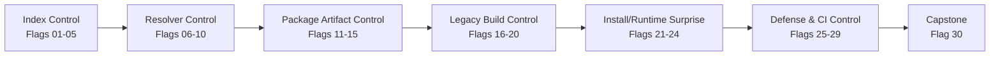
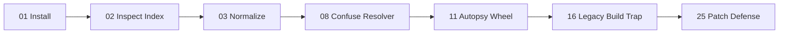

# HKPUG PyPI 30-Day CTF Flag Lab Plan

Planning snapshot: 2026-06-13

## Concept

This challenge is a 30-day "learn PyPI by hacking it safely" trail. Every flag
is tied to one practical lab. Participants are not just reading about PyPI; they
are manipulating a controlled index, package, resolver path, build path, or CI
workflow until a toy package captures a fake flag.

All package behavior is local-only:

- no real PyPI uploads
- no real package names
- no real credentials
- no network exfiltration
- all captured flags are written under `artifacts/`

## Flag Pattern

Official HKPUG flags should be team-specific and derived by the scorer:

```text
HKPUG{<flag_id>.<team_id>.<hmac_prefix>}
```

Community/practice flags can be public:

```text
HKPUG{practice.<flag_id>}
```

## Visual Track Map



## Flag Lab Matrix

| Flag | Lab | Participant Hack | Package/Index | Capture Proof | Main Lesson |
|---:|---|---|---|---|---|
| 01 | First custom index install | Install from the challenge index instead of PyPI | `indexes/trusted/simple`, `hkpug-ctf-hello` | command prints flag | pip resolves from an index URL |
| 02 | Manual simple API inspection | Find a wheel link by reading `/simple/` HTML | `simple/hkpug-ctf-hello/` | submit wheel URL/hash | the simple index is static HTML |
| 03 | Name normalization | Resolve the same package through `-`, `_`, and `.` variants | `hkpug-ctf-normalize-me` | normalized name answer | names normalize before lookup |
| 04 | Build your own mini index | Add a wheel to a local `file://` index | local `simple/` directory | pip installs from local index | indexes are links plus files |
| 05 | Broken index repair | Fix a malformed project page until pip accepts it | intentionally broken HTML | install succeeds | link shape, filenames, hashes matter |
| 06 | Version selection | Publish two toy versions and make pip select the winner | `0.1.0` vs `9.9.9` wheels | selected version captures flag | version ordering drives selection |
| 07 | Single-index install | Prove `--index-url` searches only the trusted index | trusted index only | trusted flag captured | single-index installs reduce ambiguity |
| 08 | Extra-index confusion | Make a higher-version public-sim package win | trusted + public-sim indexes | attacker wheel captures flag | `--extra-index-url` can be unsafe |
| 09 | Normalized-name collision | Use a name variant to collide with a private package | `hkpug.ctf.internal_utils` style variant | collision flag captured | naming policy matters for private packages |
| 10 | Resolver report | Predict which file pip will choose before installing | mixed indexes and versions | JSON report accepted | resolver reasoning is observable |
| 11 | Wheel autopsy | Unzip a wheel and find metadata fields | `hkpug-ctf-wheel-autopsy` | metadata flag | wheels are inspectable zip files |
| 12 | RECORD tamper check | Modify a wheel file and detect hash mismatch | wheel `RECORD` | tamper flag | installed file hashes support review |
| 13 | Console entry point | Install a package that exposes a flag-printing CLI | `hkpug-ctf-cli-tool` | CLI prints flag | entry points create installed commands |
| 14 | Import-time behavior | Import a package and detect local marker creation | `hkpug-ctf-import-marker` | marker file | imports execute package code |
| 15 | Extras path | Install `pkg[extra]` and trigger an optional dependency | `hkpug-ctf-extras-demo` | extra dependency captures flag | extras change dependency graph |
| 16 | Legacy sdist trap | Force install from sdist instead of wheel | `hkpug-ctf-sdist-trap` | build marker | source builds can run project build logic |
| 17 | Direct `setup.py` legacy path | Compare direct `setup.py` behavior with frontend build | legacy source tree | phase marker | direct `setup.py` workflows are legacy |
| 18 | Dynamic metadata | Make package metadata depend on a fake environment value | old setuptools package | metadata flag | dynamic metadata is harder to review |
| 19 | Build dependency trust | Route execution through a toy build helper dependency | `hkpug-ctf-build-helper` | build-helper marker | build dependencies are part of trust |
| 20 | Build isolation toggle | Run the same build with isolation on/off and compare access | modern package | isolation report | isolation narrows environment exposure |
| 21 | `.pth` startup surprise | Install a package whose `.pth` writes a local marker | `hkpug-ctf-startup-surprise` | startup marker | startup files can run without explicit import |
| 22 | Detect installed surprise | Inspect site-packages to locate the `.pth` cause | installed environment | submit filename/path | defenders inspect installed files |
| 23 | Hash-checked requirements | Break a wheel and make `--require-hashes` reject it | requirements file | rejection output | hashes make substitution visible |
| 24 | Pinning bypass lesson | Pin a version but swap artifact source in toy index | pinned requirement | artifact-origin answer | pinning is not enough without artifact trust |
| 25 | Safer index patch | Fix an unsafe pip command/config | victim app config | patch accepted | remove dependency confusion pattern |
| 26 | CI token trap | Audit a fake publish workflow with a long-lived token | GitHub Actions YAML | workflow flag | release automation can leak trust |
| 27 | Trusted publishing design | Replace fake token release with OIDC/trusted publishing plan | workflow patch | design answer | short-lived identity beats stored tokens |
| 28 | Lockfile comparison | Compare pip requirements and uv lock behavior | victim app | lock report | lockfiles improve reproducibility |
| 29 | Incident timeline | Reconstruct how the toy package captured the flag | mixed logs/artifacts | timeline answer | real incidents combine resolver + package + CI |
| 30 | Capstone | Capture final flags and submit defense checklist | all labs | final bundle accepted | hacking should end in remediation |

## Lab Tracks

### Track 1: Index Control

Goal: understand that pip asks an index for project files and then chooses a
candidate.

Flags:

- 01 custom index install
- 02 manual simple API inspection
- 03 name normalization
- 04 local mini index
- 05 broken index repair

### Track 2: Resolver Control

Goal: make pip pick the intended toy package.

Flags:

- 06 version selection
- 07 single-index install
- 08 extra-index confusion
- 09 normalized-name collision
- 10 resolver report

### Track 3: Package Artifact Control

Goal: inspect what gets installed and where execution paths appear.

Flags:

- 11 wheel autopsy
- 12 RECORD tamper check
- 13 console entry point
- 14 import-time behavior
- 15 extras path

### Track 4: Legacy Build Control

Goal: understand why old source-build and `setup.py` paths are risky.

Flags:

- 16 legacy sdist trap
- 17 direct `setup.py` legacy path
- 18 dynamic metadata
- 19 build dependency trust
- 20 build isolation toggle

### Track 5: Install And Runtime Surprise

Goal: learn that installed packages can affect later execution even without
obvious imports.

Flags:

- 21 `.pth` startup surprise
- 22 detect installed surprise
- 23 hash-checked requirements
- 24 pinning bypass lesson

### Track 6: Defense And CI Control

Goal: turn the hack into a fix.

Flags:

- 25 safer index patch
- 26 CI token trap
- 27 trusted publishing design
- 28 lockfile comparison
- 29 incident timeline
- 30 capstone

## Scoring And E-Cert Mapping

Score should be a progress indicator, not the main emotional reward.

| Certificate Tier | Suggested Requirement |
|---|---|
| Participation | 3 valid flags |
| Explorer | 10 valid flags across at least 2 tracks |
| Completion | 21 valid flags across at least 5 tracks |
| Finisher | flag 30 plus final defense checklist |
| Excellence | strong writeup, high score, or community contribution |

## MVP Cut

If HKPUG wants to launch quickly, start with these 7 flags:

| Flag | Why This One |
|---:|---|
| 01 | proves setup works |
| 02 | teaches simple index shape |
| 03 | teaches normalization |
| 08 | creates the first real "aha" dependency confusion moment |
| 11 | teaches wheels are inspectable |
| 16 | introduces legacy `setup.py` risk |
| 25 | ends with a defensive fix |

That MVP already gives a complete story:



## Flag 30 Capstone Design

The capstone should be a mini incident, not just another quiz.

Participants receive a vulnerable toy app:

```text
capstone/
  victim-app/
    requirements.txt
    pip.conf
    run_victim.py
  indexes/
    trusted/simple/
    public-sim/simple/
  packages-src/
    hkpug-ctf-victim-helper/
  artifacts/
```

The app has several intentional mistakes:

- it uses `--extra-index-url`
- it depends on an internal-looking package name
- one dependency is loosely pinned
- the package exists in both trusted and public-sim indexes
- one available artifact is a wheel and another is an sdist
- logs hint at an old `setup.py` build path

Participant objective:

1. create or modify a toy package in the sandbox
2. build a wheel or sdist
3. add it to the simulated public index
4. make the victim app install the participant-controlled package
5. capture `HKPUG_FAKE_FLAG` locally under `artifacts/capstone_flag.txt`
6. submit the captured flag
7. submit a short incident report and defensive patch

The capstone package is intentionally "hackable" only inside the challenge
workspace. It should not be uploaded to real PyPI, and it should not perform any
network activity.

Good capstone package behavior:

- writes `HKPUG_FAKE_FLAG` to `artifacts/capstone_flag.txt`
- records the selected package name, version, and artifact type
- optionally exposes a CLI such as `hkpug-capstone-proof`

Bad capstone package behavior:

- reading real secrets
- contacting external servers
- modifying files outside the challenge directory
- using real package names or real organization names

Capstone success should require both offense and defense:

| Part | Requirement |
|---|---|
| Exploit proof | fake flag captured locally |
| Resolver proof | explain why pip selected that artifact |
| Package proof | identify wheel/sdist/build path used |
| Defense patch | fix index configuration, pinning, hashes, or lockfile |
| Reflection | explain why newer package tooling reduces part of the risk |

In the hosted official mode, participants can submit only the encrypted answer
bundle and patch/writeup. In the community mode, they can publish their toy
attacker package in their own fork after the official window closes.
