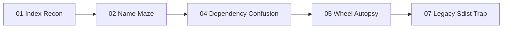

# HKPUG PyPI 30-Day CTF

Learn PyPI by hacking a safe toy package ecosystem.

This site is the participant-facing tutorial and progress hub. The GitHub repo
contains the raw challenge files; this MkDocs site explains how to play, how
each lab works, and how progress is tracked.

## Start Here

1. Read [Rules](rules.md).
2. Read [How To Play](WORKING_FORMAT.md).
3. Open the [Tutorial Index](tutorials/README.md).
4. Start with [Flag 01](labs/flag-01-index-recon.md).
5. Check the [Scoreboard](scoreboard.md).

## Learning Promise

Every flag is a hacking lab:

- point pip at a challenge index
- inspect `/simple/` pages
- make pip choose a controlled package
- inspect wheels and source distributions
- trigger harmless local flag capture
- explain the defensive fix

!!! danger "Challenge boundary"
    **No real PyPI uploads. No real package names. No real credentials.**

    All hacking happens inside the toy challenge workspace.

## MVP Trail

