# HKPUG PyPI 30-Day CTF

Learn PyPI by hacking a safe toy package ecosystem.

This site is the participant-facing lab and progress hub. The GitHub repo
contains the raw challenge files; this MkDocs site explains how to play, how
each lab works, and how progress is tracked.

## Start Here

1. Read [Rules](rules.md).
2. Read [How To Play](WORKING_FORMAT.md).
3. Start with [Flag 01](labs/flag-01-index-recon.md).
4. Use [Lab Guides](labs/guides/index.md) when you want background.
5. Check [Hints](hints.md) and the [Scoreboard](scoreboard.md).

## Learning Promise

Every flag is a hacking lab:

- point pip at a challenge index
- inspect `/simple/` pages
- make pip choose a controlled package
- inspect wheels and source distributions
- trigger harmless local flag capture
- explain the defensive fix

!!! danger "Challenge boundary"
    **No real PyPI uploads. No real package names. No real credentials.**

    All hacking happens inside the toy challenge workspace.

## Full 12-Flag Trail

```mermaid
flowchart LR
  F01["01 Index Recon"] --> F02["02 Name Maze"]
  F02 --> F03["03 Resolver Duel"]
  F03 --> F04["04 Dependency Confusion"]
  F04 --> F05["05 Wheel Autopsy"]
  F05 --> F06["06 Entry Point Ambush"]
  F06 --> F07["07 Legacy Sdist Trap"]
  F07 --> F08["08 Build Isolation"]
  F08 --> F09["09 Startup Surprise"]
  F09 --> F10["10 Pin, Hash, Lock"]
  F10 --> F11["11 CI Publisher Trap"]
  F11 --> F12["12 Capstone Incident"]
```

Each flag page contains the background needed for that flag. The Lab Guides sit
inside the Labs section as backup references for commands, vocabulary, history,
and submission workflow.

## Expected Time

This is a 30-day calendar challenge, not a 60-hour homework project. A beginner
who reads the flag pages should not need to search the web for every packaging
term.

| Player type | Expected hands-on time |
|---|---:|
| Experienced packaging/security person | 12-20 hours |
| Normal Python developer | 20-30 hours |
| Beginner reading the flag pages carefully | 25-35 hours |
| Team of 2-3 people | 16-25 shared hours |

If a beginner regularly needs more than 3 hours before the final-mile puzzle of
a non-capstone lab, the lab text is probably missing background.
