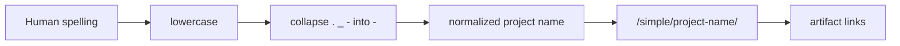

# Flag 02: Name Maze

!!! danger "Challenge boundary"
    **Use only toy package names from the lab.**

    Do not search for confusingly similar names around real projects or real
    maintainers.

## Plain English

Package names have a display form and a lookup form. Humans may write
`HKPUG_CTF.Normalize.Me`, but the index lookup normalizes punctuation and case.

For Python package indexes, runs of `.`, `_`, and `-` are treated similarly for
the project URL. That means names that look different to a human can point to
the same normalized project page.

## Background: How This Works

There are two names in your head:

| Name type | Example | Meaning |
|---|---|---|
| display spelling | `HKPUG_CTF.Normalize.Me` | what a human typed |
| lookup spelling | `hkpug-ctf-normalize-me` | what the index page usually uses |

The quick normalization rule for this challenge:

1. lowercase the name
2. replace runs of `.`, `_`, and `-` with one `-`

So do not solve this by staring at punctuation. Convert each candidate to its
lookup spelling, then compare project pages.

Terms for this flag:

| Term | Meaning |
|---|---|
| normalization | converting different-looking names into one lookup form |
| canonical name | the normalized package name pip uses for lookup |
| collision | two human-looking names ending up with the same lookup name |
| project page | the index page matching the canonical name |

Why this exists: Python package names have been written with different
punctuation styles over time. Normalization lets tools treat those spellings
consistently. The security lesson is that naming policy must account for the
normalized form, not only the pretty display form.

What to observe:

1. the raw spelling the lab gives you
2. the normalized spelling
3. whether the normalized project page exists
4. which artifact appears on that project page

!!! note "Teacher note"
    This lab is not about memorizing a standard. It is about noticing that the
    name you type is not always the name pip uses for lookup.

## Visual Map



## Try This Slowly

You can practice the normalization rule with a tiny Python snippet:

```bash
python - <<'PY'
import re

names = [
    "HKPUG_CTF.Normalize.Me",
    "hkpug-ctf-normalize-me",
    "hkpug.ctf_normalize-me",
]

for name in names:
    normalized = re.sub(r"[-_.]+", "-", name).lower()
    print(f"{name:28} -> {normalized}")
PY
```

When you inspect the toy index, look for the normalized form, not the prettiest
human spelling.

## Story

The challenge gives you several package name spellings. Some are noisy on
purpose. Your job is to normalize them, find the one real project page in the
toy index, and prove which artifact pip can install.

## What You Are Trying To Control

You are trying to control name lookup.

Ask these questions slowly:

- What did the human type?
- What normalized name does pip search for?
- What project page exists in the index?
- Which artifact did that page offer?

## Files You Will Get

```text
labs/flag-02-name-maze/
  indexes/
  packages-src/
  victim/
  artifacts/
```

## First Checks

```bash
cd labs/flag-02-name-maze
python -m venv .venv
. .venv/bin/activate
python -m pip install --upgrade pip
export HKPUG_FAKE_FLAG="HKPUG{practice.flag-02}"
```

Practice with these shapes:

```text
HKPUG_CTF.Normalize.Me
hkpug-ctf-normalize-me
hkpug.ctf_normalize-me
```

You can also ask Python to normalize names if the lab provides the helper, or
you can do it by hand: lowercase the name, then collapse runs of `.`, `_`, and
`-` into `-`.

## Your Task

Find the normalized project page, install the correct toy artifact, and capture
the flag.

The final mile is yours: this page gives the normalization rule, but not the
exact project page that contains the winning artifact.

## What To Submit

- normalized name
- package variants tested
- project page path
- captured flag

## Hints

1. Nudge: do not compare the raw spelling; compare the normalized spelling.
2. Direction: the project page path should match the normalized name.
3. Guided: send the variants you tested before asking.

## Defense Notes

Choose internal package names with a clear prefix and check normalized
collisions, not only the pretty spelling in documentation.
