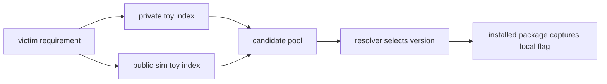

# Flag 04: Dependency Confusion

!!! danger "Challenge boundary"
    **This lab uses a simulated public index, not real PyPI.**

    Do not upload packages to real PyPI and do not target real internal package
    names.

## Plain English

Dependency confusion happens when a project means to install a private package,
but the installer can also see a public-looking package with the same name.

If both sources are searched together, pip may choose the candidate that best
matches its resolver rules. A higher version from the wrong place can beat the
package you expected.

## Background: How This Works

The subtle point is that `--extra-index-url` adds more candidates. It is not a
clean security boundary.

Think of pip seeing one combined candidate pool:

```text
private index candidates + extra index candidates -> resolver chooses one
```

So the lab question is not only "which index did we trust?" It is:

1. Which package name did the victim request?
2. Which indexes contained that name?
3. Which versions existed in each index?
4. Which candidate did pip choose?

Once you can answer those four questions, the exploit and the defense are both
much easier to explain.

Terms for this flag:

| Term | Meaning |
|---|---|
| private index | a package source intended for internal packages |
| public index | a package source anyone might publish to |
| simulated public index | the safe toy public index in this CTF |
| `--extra-index-url` | a pip option that adds another source of candidates |
| dependency confusion | installing the wrong package because name/source intent is unclear |

History: dependency confusion became widely discussed after researchers showed
that internal package names could sometimes be claimed on public registries.
This lab keeps the idea local and harmless, but the mental model is the same:
if the installer sees an unexpected candidate, it may select it.

What to observe:

1. whether the package exists in both indexes
2. which index has which version
3. whether pip treats the extra index as a fallback or as more candidates
4. which index supplied the installed file

!!! note "Teacher note"
    The surprising part is not that pip is broken. Pip is doing what it was
    asked to do: search the configured sources and choose a candidate. The
    mistake is giving it a risky set of sources.

## Visual Map



## Try This Slowly

Capture the verbose install output:

```bash
python -m pip install -vv -r victim/requirements.txt \
  2>&1 | tee artifacts/pip-flag-04.log
```

Then ask two very plain questions:

```bash
grep -E "Looking in indexes|Found link|Downloading" artifacts/pip-flag-04.log
python -m pip show hkpug-ctf-internal-utils
```

You are looking for the selected version and the URL or path it came from.

## Story

The victim app trusts a private toy index but also uses a simulated public toy
index. The same package name exists in both places.

Your job is to make pip choose the higher-version package from `public-sim`,
prove which index won, and capture the fake flag locally.

## What You Are Trying To Control

You are trying to control source priority and candidate selection.

The dangerous pattern to recognize is:

```bash
python -m pip install \
  --index-url "$PRIVATE_INDEX_URL" \
  --extra-index-url "$PUBLIC_SIM_INDEX_URL" \
  hkpug-ctf-internal-utils
```

The exact command in the lab may differ, but the question is the same: which
source supplied the installed file?

## Files You Will Get

```text
labs/flag-04-dependency-confusion/
  indexes/
  packages-src/
  victim/
  artifacts/
```

## First Checks

```bash
cd labs/flag-04-dependency-confusion
python -m venv .venv
. .venv/bin/activate
python -m pip install --upgrade pip
export HKPUG_FAKE_FLAG="HKPUG{practice.flag-04}"
```

Inspect both project pages before installing:

```bash
python -m pip install -vv -r victim/requirements.txt
python -m pip show hkpug-ctf-internal-utils
```

Verbose output should show which links pip considered.

## Your Task

Make the simulated public package win, capture the fake flag, and then propose a
defensive install configuration that prevents the confusion.

The final mile is yours: this page explains the risk, but not the exact version
that wins.

## What To Submit

- captured flag
- selected package version
- which index won
- defensive fix

## Hints

1. Nudge: compare the versions visible on both project pages.
2. Direction: `--extra-index-url` does not mean "only use this if private fails"
   in the way many people hope.
3. Guided: ask after you can show verbose pip output.

## Defense Notes

Prefer one trusted package source for private dependencies, exact internal names,
and lockfiles or hashes. Do not mix a private namespace with an uncontrolled
public search path.
