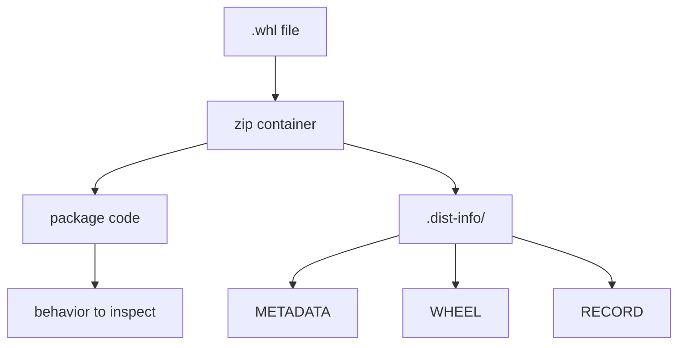

# Flag 05: Wheel Autopsy

!!! danger "Challenge boundary"
    **Inspect only the toy wheel files from this lab.**

    Do not run unknown real packages just to see what they do.

## Plain English

A wheel is a package file ending in `.whl`. It is basically a zip file with a
special layout. You can open it before installing it.

This lab teaches you that package review is not magic. You can inspect metadata,
installed files, entry points, and hashes with ordinary tools.

## Background: How This Works

Inside a wheel, the most important directory usually ends with `.dist-info`.

Look there first:

| File | What it tells you |
|---|---|
| `METADATA` | package name, version, dependencies, extras |
| `WHEEL` | wheel format and compatibility information |
| `RECORD` | file list and hashes for installed files |
| entry point metadata | commands the package may install |

You are not hunting for a random hidden string. You are reading the package's
own shipping label and file list.

Terms for this flag:

| Term | Meaning |
|---|---|
| wheel | a built Python package file ending in `.whl` |
| zip file | the container format a wheel uses |
| `.dist-info` | the metadata directory inside a wheel |
| `METADATA` | name, version, dependencies, and extras |
| `RECORD` | installed file list and hashes |

History: wheels were introduced so users could install built packages without
running a source build every time. That is useful for speed and safety, but a
wheel can still contain files, metadata, commands, and Python code worth
reviewing.

What to observe:

1. the wheel filename and version
2. the `.dist-info` directory
3. package files that will land in `site-packages`
4. metadata that changes install or runtime behavior

!!! note "Teacher note"
    A wheel is less scary once you open it. Treat it like a zip file with a
    label, a manifest, and the package's Python files inside.

## Visual Map



## Try This Slowly

List the wheel without installing it:

```bash
python -m zipfile --list wheels/*.whl
```

Extract it to a throwaway folder:

```bash
mkdir -p artifacts/wheel-unpacked
python -m zipfile --extract wheels/*.whl artifacts/wheel-unpacked
find artifacts/wheel-unpacked -maxdepth 3 -type f | sort
```

Then read the metadata:

```bash
find artifacts/wheel-unpacked -name METADATA -o -name RECORD -o -name WHEEL
```

## Story

A wheel was installed in the victim environment. Something about it leads to the
flag. Before trusting it, you need to open the wheel and read what it contains.

## What You Are Trying To Control

You are trying to inspect an artifact before relying on it.

Look for:

- `METADATA`: name, version, dependencies, extras
- `WHEEL`: wheel generator and compatibility
- `RECORD`: installed file list and hashes
- package modules
- entry point metadata

## Files You Will Get

```text
labs/flag-05-wheel-autopsy/
  wheels/
  victim/
  artifacts/
```

## First Checks

```bash
cd labs/flag-05-wheel-autopsy
python -m venv .venv
. .venv/bin/activate
python -m pip install --upgrade pip
export HKPUG_FAKE_FLAG="HKPUG{practice.flag-05}"
```

Open a wheel without installing it:

```bash
python - <<'PY'
from pathlib import Path
from zipfile import ZipFile

wheel = next(Path("wheels").glob("*.whl"))
with ZipFile(wheel) as zf:
    for name in zf.namelist():
        print(name)
PY
```

You can extract it to a temporary folder if reading inside the zip is annoying.

## Your Task

Find the metadata or installed file behavior that leads to the flag. Then prove
the installed distribution name and version.

The final mile is yours: this page tells you which files matter, but not which
one contains the key clue.

## What To Submit

- captured flag or metadata flag
- distribution name
- version
- one suspicious or important file found

## Hints

1. Nudge: start in the `.dist-info/` directory.
2. Direction: `RECORD` tells you what files the wheel expects to install.
3. Guided: send the wheel file list before asking.

## Defense Notes

Artifact review is a useful habit. In real workflows, combine review with
trusted sources, reproducible builds, signing or provenance where available, and
hash-checked installs.
