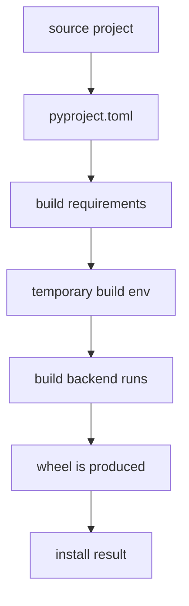

# Flag 08: Build Isolation Lab

!!! danger "Challenge boundary"
    **Build only the toy source distributions from this lab.**

    Do not publish build dependencies to real PyPI or impersonate real build
    tools.

## Plain English

Some packages are not installed from ready-made wheels. Pip may need to build a
wheel locally first. Modern Python projects describe their build tools in
`pyproject.toml`.

Build isolation means pip creates a temporary build environment and installs the
build requirements there. This is usually safer and more reproducible, but it
also means build dependencies have their own resolver story.

## Background: How This Works

Runtime dependencies and build dependencies are not the same.

| Dependency type | Where it appears | When it matters |
|---|---|---|
| build dependency | `pyproject.toml` `[build-system]` | before the package is built |
| runtime dependency | package metadata or requirements file | after the package is installed |

With build isolation, pip creates a temporary environment and installs build
dependencies there. That means you may see pip resolving packages before the
victim package itself exists as a wheel.

In this flag, the build log is the map. Search for build dependency installation
before looking at normal runtime imports.

Terms for this flag:

| Term | Meaning |
|---|---|
| `pyproject.toml` | modern project configuration file |
| build backend | tool that knows how to build the package |
| build requirement | package needed before the project can be built |
| build isolation | temporary environment pip creates for building |
| runtime dependency | package needed after installation |

History: Python packaging moved build-system configuration into
`pyproject.toml` so tools could know how to build a project without guessing.
The important table is usually `[build-system]`. It tells pip what build backend
and build requirements are needed.

What to observe:

1. the `[build-system]` table in `pyproject.toml`
2. which build helper version pip installs
3. whether `--no-build-isolation` changes behavior
4. where the local proof marker appears

!!! note "Teacher note"
    Build isolation is like pip saying, "I will build this package in a clean
    little room." The interesting question is what pip brings into that room.

## Visual Map



## Try This Slowly

Print the build system table before you build:

```bash
python - <<'PY'
from pathlib import Path

text = Path("victim/pyproject.toml").read_text()
inside = False
for line in text.splitlines():
    if line.strip() == "[build-system]":
        inside = True
    elif line.startswith("[") and inside:
        break
    if inside:
        print(line)
PY
```

Then compare isolated and non-isolated builds:

```bash
python -m pip wheel -vv --index-url "$CHALLENGE_INDEX_URL" ./victim \
  2>&1 | tee artifacts/build-isolated.log

python -m pip wheel -vv --no-build-isolation \
  --index-url "$CHALLENGE_INDEX_URL" ./victim \
  2>&1 | tee artifacts/build-no-isolation.log
```

## Story

The victim package is a source distribution. Its `pyproject.toml` asks for a
toy build helper. Two versions of that helper exist in the challenge ecosystem.
Only one leads to the local flag capture.

Your job is to compare isolated and non-isolated builds and prove which build
dependency was used.

## What You Are Trying To Control

You are trying to control build-time dependency resolution.

Normal runtime dependencies answer: "What does the package need after install?"

Build dependencies answer: "What does pip need before it can even build the
package?"

## Files You Will Get

```text
labs/flag-08-build-isolation-lab/
  indexes/
  packages-src/
  victim/
  artifacts/
```

## First Checks

```bash
cd labs/flag-08-build-isolation-lab
python -m venv .venv
. .venv/bin/activate
python -m pip install --upgrade pip build
export HKPUG_FAKE_FLAG="HKPUG{practice.flag-08}"
```

Inspect the build system table:

```bash
python - <<'PY'
from pathlib import Path
print(Path("victim/pyproject.toml").read_text())
PY
```

Run one build with isolation and one without:

```bash
python -m pip wheel -vv --index-url "$CHALLENGE_INDEX_URL" ./victim
python -m pip wheel -vv --no-build-isolation --index-url "$CHALLENGE_INDEX_URL" ./victim
```

## Your Task

Find which build helper version is selected during the isolated build, then use
that knowledge to capture the fake flag.

The final mile is yours: the important clue is in the build log, not in this
page.

## What To Submit

- captured flag
- build helper package name and version
- whether build isolation was enabled
- one defensive fix

## Hints

1. Nudge: search the verbose build log for `Installing build dependencies`.
2. Direction: build dependencies come from `pyproject.toml`, not from
   `requirements.txt`.
3. Guided: request a hint with both build logs attached.

## Defense Notes

Lock and review build dependencies. Treat the build environment as part of the
supply chain, not as invisible plumbing.
