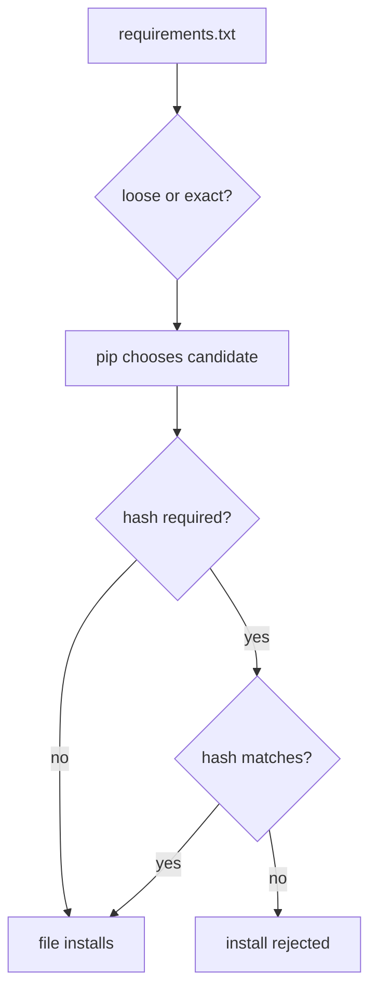

# Flag 10: Pin, Hash, Lock

!!! danger "Challenge boundary"
    **Use only the challenge requirements files and toy packages.**

    Do not use real private dependency names or real production lockfiles in
    public submissions.

## Plain English

A requirement like `package>=1.0` gives pip room to choose many versions. A pin
like `package==1.2.3` gives pip much less room. A hash says: "even if the name
and version match, the file bytes must match this exact fingerprint."

This lab teaches the difference between "I asked for roughly this dependency"
and "I can reproduce exactly this install."

## Background: How This Works

Dependency control has levels:

| Requirement style | Example | What it protects |
|---|---|---|
| loose range | `pkg>=1.0` | allows many future versions |
| exact pin | `pkg==1.2.3` | fixes the version |
| hash check | `--hash=sha256:...` | fixes the exact file bytes |
| lockfile | generated dependency record | fixes the whole dependency decision |

The trap is that "same name and version" is not always enough. If the exact file
matters, use hashes or a lock process that records hashes.

In this flag you must do both sides: show the weak install can be abused, then
show the fixed install rejects the unsafe candidate.

Terms for this flag:

| Term | Meaning |
|---|---|
| pin | exact version rule such as `pkg==1.2.3` |
| range | flexible version rule such as `pkg>=1.0` |
| hash | fingerprint of exact file bytes |
| lockfile | recorded dependency decision for reproducible installs |
| tampering | replacing or swapping an artifact unexpectedly |

History: version pins solve only part of reproducibility. They say which version
you wanted, but not always which exact file bytes you received. Hash-checking
adds that missing file identity check.

What to observe:

1. which requirement line is loose
2. which artifact pip chooses before the fix
3. the hash of the safe artifact
4. the error pip gives after unsafe content is rejected

!!! note "Teacher note"
    A version pin answers "which version?" A hash answers "which exact file?"
    This lab is about feeling that difference in your hands.

## Visual Map



## Try This Slowly

Read the requirements file:

```bash
nl -ba victim/requirements.txt
```

Hash a known-good artifact:

```bash
python -m pip hash path/to/package.whl
```

Try a hash-checked install:

```bash
python -m pip install --require-hashes -r victim/requirements.lock \
  2>&1 | tee artifacts/pip-hash-check.log
```

The failed install after the fix is success. It proves the swap was blocked.

## Story

The victim app has a weak requirements file. A toy malicious candidate can win
without changing the victim source code. Later, you must patch the requirements
so the same trick fails.

## What You Are Trying To Control

You are trying to control reproducibility.

Questions to ask:

- Is the version pinned exactly?
- Can a different index provide the same name?
- Can a different file provide the same version?
- Does the install require hashes?

## Files You Will Get

```text
labs/flag-10-pin-hash-lock/
  indexes/
  packages-src/
  victim/
  artifacts/
```

## First Checks

```bash
cd labs/flag-10-pin-hash-lock
python -m venv .venv
. .venv/bin/activate
python -m pip install --upgrade pip
export HKPUG_FAKE_FLAG="HKPUG{practice.flag-10}"
```

Read the requirements before installing:

```bash
python - <<'PY'
from pathlib import Path
print(Path("victim/requirements.txt").read_text())
PY
```

Useful commands:

```bash
python -m pip install -r victim/requirements.txt --index-url "$CHALLENGE_INDEX_URL"
python -m pip hash path/to/package.whl
python -m pip install --require-hashes -r victim/requirements.lock
```

## Your Task

First, exploit the weak requirement and capture the flag. Then patch the victim
dependency file so the same package swap is rejected.

The final mile is yours: this page does not tell you which requirement line is
weakest.

## What To Submit

- captured flag
- vulnerable requirement line
- fixed requirement or lock entry
- evidence that the unsafe install is rejected after the fix

## Hints

1. Nudge: compare `requirements.txt` with the package versions in the index.
2. Direction: `--require-hashes` changes what pip accepts.
3. Guided: include your failing safe-install output.

## Defense Notes

For important deployments, prefer lockfiles or hash-checked installs. Exact pins
alone are useful, but hashes protect against a different file with the same name
and version.
