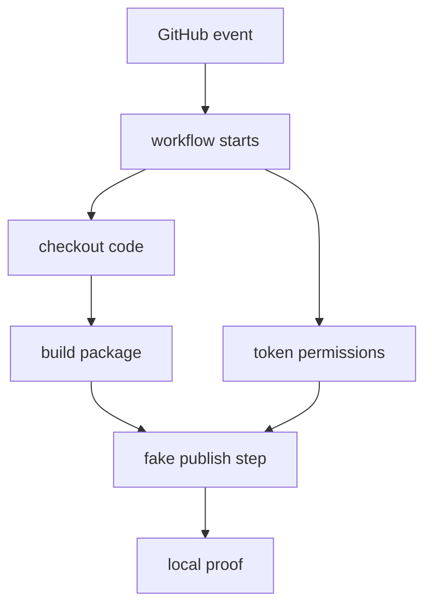

# Flag 11: CI Publisher Trap

!!! danger "Challenge boundary"
    **This lab uses fake workflows, fake tokens, and toy package names.**

    Do not test release-workflow attacks against real repositories or real
    package publishing credentials.

## Plain English

Many packages are published by CI. CI means an automated workflow runs after a
push, tag, release, or pull request. If the workflow trusts the wrong event or
builds the wrong files, it may publish something the maintainer did not mean to
publish.

This lab does not publish anything. You audit a fake workflow and prove which
package artifact would have been released.

## Background: How This Works

Read a CI workflow like a security checklist:

| Workflow part | Question |
|---|---|
| trigger | what event starts the job? |
| checkout | whose code is being built? |
| permissions | what can the job write? |
| build step | what artifact is created? |
| publish step | where would it go? |

The dangerous mistake is usually a trust boundary mistake. A protected tag,
maintainer-controlled branch, and untrusted pull request are not the same kind
of input.

This lab uses a fake publisher so the proof stays local.

Terms for this flag:

| Term | Meaning |
|---|---|
| CI | automation that runs on repository events |
| workflow | YAML file describing automation jobs |
| trigger | event that starts a workflow |
| permission | what the workflow token is allowed to do |
| publish job | automation step that releases a package |

History: many Python projects publish from GitHub Actions or another CI system.
That can be safer than publishing from a laptop, but only if the workflow trusts
the right events and artifacts. The danger is not "CI is bad"; it is confusing a
maintainer-controlled release event with untrusted contributor input.

What to observe:

1. which event starts the workflow
2. which code the job checks out
3. what token permissions the job has
4. what artifact the fake publisher would publish

!!! note "Teacher note"
    Read CI YAML like a recipe. The bug is often not one scary line; it is the
    wrong ingredients being trusted together.

## Visual Map



## Try This Slowly

Print the workflow files:

```bash
python - <<'PY'
from pathlib import Path

for path in Path(".github/workflows").glob("*.yml"):
    print(f"\n--- {path} ---")
    print(path.read_text())
PY
```

Mark the trust boundary by hand:

```text
event:
code being built:
permissions:
artifact:
publisher:
```

If you cannot fill those five fields, keep reading before running anything.

## Story

The challenge gives you a toy repository with a release workflow. The workflow
looks plausible at first glance. It builds a package and sends it to a fake
publisher script.

One detail makes the workflow unsafe. Your job is to find the detail, capture
the local flag through the fake publisher, and patch the workflow.

## What You Are Trying To Control

You are trying to control release trust.

Look for:

- which event triggers the workflow
- which branch or tag is trusted
- whether the workflow builds checked-out code or generated artifacts
- token permissions
- whether untrusted pull request code can affect publishing

## Files You Will Get

```text
labs/flag-11-ci-publisher-trap/
  fake-repo/
    .github/workflows/
    package/
    scripts/
  artifacts/
```

## First Checks

```bash
cd labs/flag-11-ci-publisher-trap/fake-repo
python -m venv .venv
. .venv/bin/activate
python -m pip install --upgrade pip build
export HKPUG_FAKE_FLAG="HKPUG{practice.flag-11}"
```

Read the workflow like a program:

```bash
python - <<'PY'
from pathlib import Path
for path in Path(".github/workflows").glob("*.yml"):
    print(f"--- {path} ---")
    print(path.read_text())
PY
```

Run only the provided fake publisher script. It writes local proof instead of
uploading anywhere.

## Your Task

Identify the unsafe workflow assumption, produce the local fake publish proof,
and patch the workflow so the unsafe path would no longer publish.

The final mile is yours: the docs will not name the exact bad line.

## What To Submit

- captured flag or fake publish proof
- unsafe workflow line or setting
- patched workflow snippet
- one sentence explaining why the patch works

## Hints

1. Nudge: start at the `on:` block, then read permissions.
2. Direction: publishing from untrusted pull request context is different from
   publishing from a protected tag.
3. Guided: request a hint with the workflow text you inspected.

## Defense Notes

Keep release jobs tied to protected refs, use minimal permissions, separate
build and publish trust boundaries, and prefer trusted publishing mechanisms
where available.
