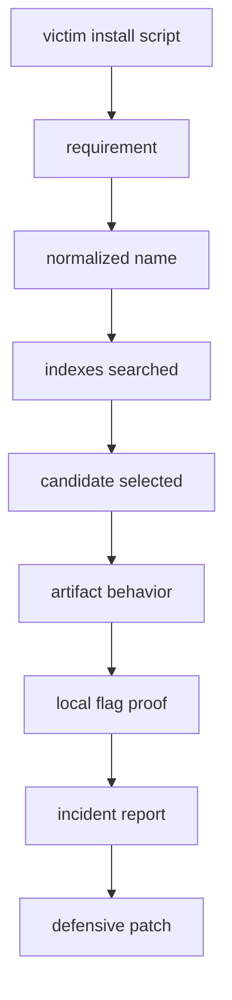

# Flag 12: Capstone Incident

!!! danger "Challenge boundary"
    **The capstone is still a toy sandbox.**

    Do not upload packages to real PyPI, impersonate real projects, contact
    external callbacks, or collect real secrets.

## Plain English

The capstone asks you to build and investigate a complete toy incident. Yes,
you create a package that is "hackable" in the CTF sense: it is challenge-owned,
local, harmless, and designed to prove a packaging weakness.

You are not attacking the real Python ecosystem. You are showing that you can
think like both sides: the attacker who understands pip behavior, and the
maintainer who can remove the weakness.

## Background: How This Works

The capstone is less about learning a new trick and more about choosing the
right old trick.

Draw the install path first:

```text
victim requirement -> package name normalization -> indexes searched
-> candidates found -> artifact selected -> code path that captures proof
```

Then mark each part as known or unknown. Do not build a package until you know
which selection rule you are trying to influence.

A good capstone solve has two halves:

- offense: prove your challenge-owned artifact was selected
- defense: make the same selection impossible or harmless

Terms for this flag:

| Term | Meaning |
|---|---|
| incident | a short investigation of what happened and why |
| attacker package | challenge-owned package artifact you control locally |
| selection proof | evidence showing why pip chose your artifact |
| timeline | ordered explanation of the install path and proof capture |
| remediation | patch or policy that prevents the same issue |

What makes this different: earlier flags tell you which concept matters. The
capstone asks you to choose. Before changing files, write down the install path
and mark the weak point. That prevents random package building.

What to observe:

1. the victim's requested dependency
2. all indexes and artifacts the victim can see
3. the selected package name, version, and file
4. the exact defense that blocks the same path

!!! note "Teacher note"
    The capstone is not asking you to know a new trick. It is asking you to
    choose the right trick, explain it clearly, and then close the hole.

## Visual Map



## Try This Slowly

Make a worksheet before you build anything:

```text
Requested package:
Normalized name:
Indexes searched:
Candidate versions:
Artifact I want to win:
Why pip should select it:
Where proof should appear:
Defense after capture:
```

Then read the victim files:

```bash
find victim -maxdepth 2 -type f -print
```

The capstone rewards patience. A five-minute map can save an hour of random
package building.

## Story

The victim service installs dependencies from a mixed challenge ecosystem. You
receive a toy package namespace, a private-looking index, a public-looking
index, a victim install script, and a fake incident report template.

Your job is to create the controlled package artifact, make the victim select
it, capture the flag, and then write the defense.

## What You Are Expected To Combine

You will probably need ideas from several earlier flags:

- index layout from Flag 01
- name normalization from Flag 02
- resolver behavior from Flag 03
- dependency confusion from Flag 04
- wheel or sdist inspection from Flags 05 to 08
- runtime proof from Flags 06 or 09
- reproducible install defense from Flag 10
- release-process thinking from Flag 11

Not every capstone instance must use every idea. The point is to recognize which
ideas matter for the incident in front of you.

## Files You Will Get

```text
labs/flag-12-capstone-incident/
  indexes/
  packages-src/
  victim/
  incident-report/
  artifacts/
```

## First Checks

```bash
cd labs/flag-12-capstone-incident
python -m venv .venv
. .venv/bin/activate
python -m pip install --upgrade pip build
export HKPUG_FAKE_FLAG="HKPUG{practice.flag-12}"
```

Read the victim install path before changing anything:

```bash
python - <<'PY'
from pathlib import Path
for path in ["victim/requirements.txt", "victim/install.sh"]:
    p = Path(path)
    if p.exists():
        print(f"--- {p} ---")
        print(p.read_text())
PY
```

## Your Task

Build a challenge-owned package artifact, place it where the victim can select
it, trigger the local flag capture, and write a short incident report.

The final mile is intentionally open. You choose which earlier technique fits
the victim. The lab page will not tell you the exact package name, version, or
metadata trick.

## What To Submit

- captured flag
- package name and version used
- index or artifact path that won
- short incident timeline
- defensive patch or lockfile change

## Hints

1. Nudge: draw the install path before you build anything.
2. Direction: prove why the victim selected your artifact, not only that it did.
3. Guided: in hosted mode, send your candidate-selection evidence with the hint
   request.

## Defense Notes

A good capstone answer ends with boring, practical defense: explicit indexes,
protected release paths, exact dependency intent, reproducible installs, and no
privileged execution of untrusted package code.
