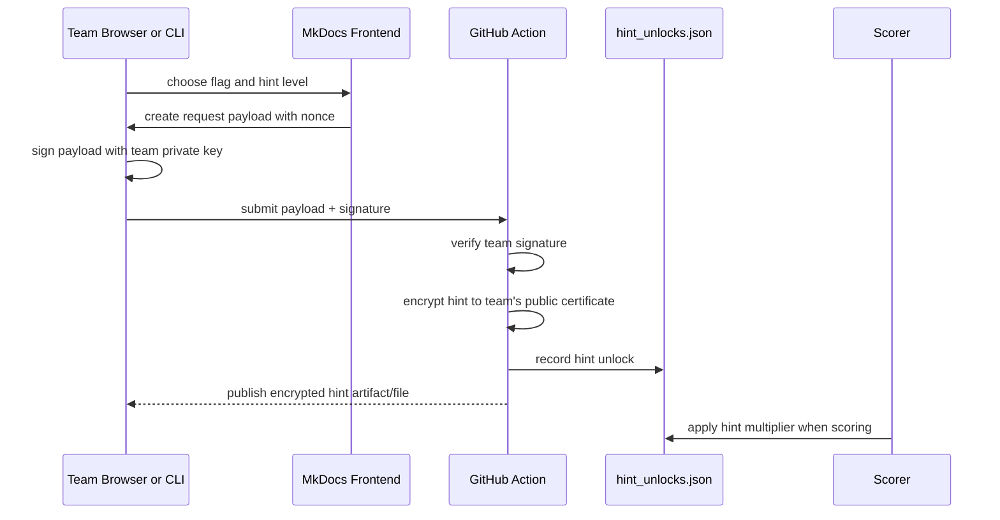

# Private Hint Design

The best private hint design is:



## Does This Make Sense?

Yes. It is a strong model because it separates responsibilities cleanly:

- the frontend gives a nice user experience
- the team signature proves who is asking
- GitHub Actions is the trusted verifier and ledger writer
- hints stay encrypted to the requesting team
- the scorer can apply a per-team score penalty

The frontend should not be trusted to choose the correct hint or record the
official "hint sent" mark. A public static frontend can be inspected and
modified by anyone. It can prepare and submit a request, but the trusted action
must verify, encrypt, and record.

## Request Payload

Example payload:

```json
{
  "schema_version": 1,
  "team_id": "hk-01",
  "flag_id": "flag-04",
  "hint_level": 1,
  "nonce": "20260613T120000Z-7f4a2c",
  "requested_at": "2026-06-13T12:00:00Z"
}
```

The team signs the canonical JSON payload with its team private key.

## Unlock Ledger

The trusted workflow records:

```json
{
  "schema_version": 1,
  "unlocks": [
    {
      "team_id": "hk-01",
      "flag_id": "flag-04",
      "hint_level": 1,
      "requested_at": "2026-06-13T12:00:00Z",
      "request_sha256": "..."
    }
  ]
}
```

The scorer reads this ledger. If `hk-01` used Hint 1 for `flag-04`, only that
team receives the Hint 1 multiplier for that flag.

## Hint Delivery

The action can publish encrypted hints under:

```text
hints-unlocked/
  flag-04/
    hint-1/
      hk-01.cms
```

The file is safe to publish because only the team private key can decrypt it.

## Signing UX Options

### Option A: Browser Signing

The MkDocs page asks the user to paste or load the team private key and signs in
the browser with Web Crypto or a small JavaScript helper.

Pros:

- nice UX
- no local command line needed

Cons:

- asking users to load private keys into a browser is uncomfortable
- browser crypto and PEM formats can be fiddly
- participants may distrust the page, reasonably

### Option B: Local CLI Signing

The page shows the request payload. The participant runs:

```bash
python tools/request_hint.py \
  --payload hint-request.json \
  --private-key /path/to/team_private_key.pem
```

Pros:

- private key stays local
- reuses the workshop signing model
- easier to test

Cons:

- less slick than browser-only UX

### Option C: GitHub Identity Only

Use GitHub login or comments as identity.

Pros:

- easy for participants

Cons:

- static GitHub Pages cannot safely hold OAuth secrets
- GitHub comments are public
- GitHub identity alone does not map cleanly to team certificate identity

## Recommendation

For this project:

1. MVP: public scheduled hints.
2. HKPUG official run: encrypted scheduled hints if time is short.
3. Better official run: signed private hint unlocks with local CLI signing.
4. Later polish: browser signing after the CLI flow is stable.

The signed private hint model is absolutely viable with the current encrypted
submission design. The main extra work is the request workflow and the
`hint_unlocks.json` scoring integration.
