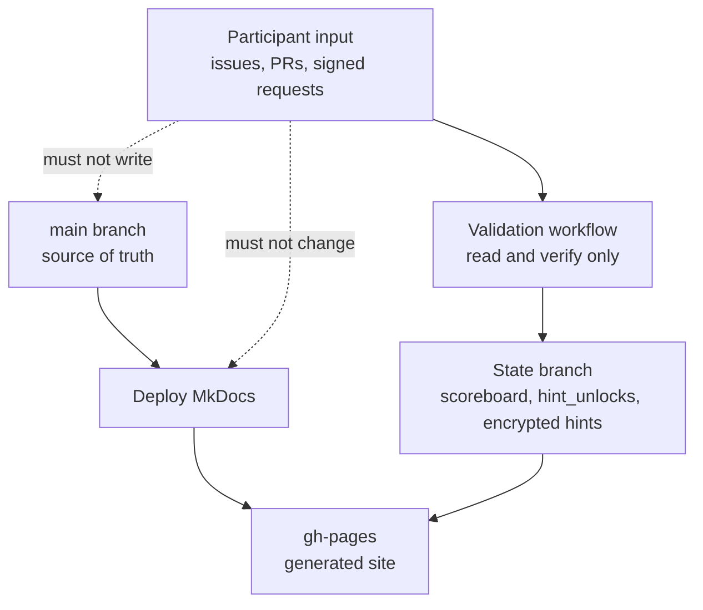
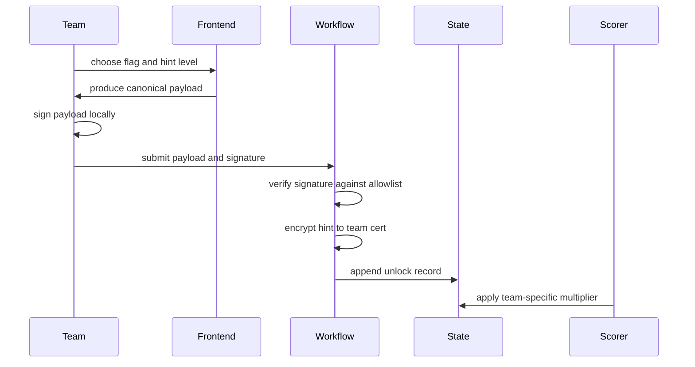

# Repository Safety Model

The challenge must remain hackable without letting participants hack the
original repository.

## Threat Model

Participants control:

- forks
- pull request content
- issue text
- PR comments
- signed hint request payloads
- encrypted answer bundles
- package code they run locally

Participants must not control:

- `main`
- workflow definitions
- GitHub secrets
- team allowlist
- hidden answer keys
- scoreboard updates for other teams
- hint unlocks for other teams

## Trust Boundaries



## Branch Model

| Branch | Purpose | Who/What Writes |
|---|---|---|
| `main` | source docs, lab source, workflows | maintainers only |
| `gh-pages` | generated MkDocs site | deploy workflow |
| future `scoreboard-state` | scoring and hint ledgers | trusted scorer only |

`main` should never be updated by participant-triggered workflows.

## Interaction Model

### Safe

- participant opens an issue with a signed hint request
- workflow verifies the signature as data
- workflow encrypts a hint to the team's public certificate
- workflow writes encrypted hint output to a state path
- scorer reads state and applies the team's hint penalty

### Unsafe

- workflow checks out PR code and runs it with `contents: write`
- workflow parses issue text into a shell command
- workflow commits to `main` after a participant-triggered event
- frontend stores secret hints or keys in JavaScript
- Pages site writes authoritative state directly

## Workflow Rules

Use these defaults:

```yaml
permissions:
  contents: read
```

Only elevate in a specific job that needs it:

```yaml
permissions:
  contents: write
  issues: write
```

Participant-triggered workflows should:

- checkout trusted `main`, not PR code
- copy only allowlisted files if PR files are needed
- treat all submitted files as data
- verify signatures before writing state
- write only to state branches or encrypted output paths

## Pull Request Safety

For challenge submissions:

- use `pull_request_target` only to inspect PR metadata and changed filenames
- do not run submitted package code
- copy only allowlisted encrypted files
- verify manifest digest and signature
- pass encrypted artifacts to trusted scoring

For community code contributions:

- use normal pull requests
- require human review before merge
- do not expose secrets to PR workflows

## Hint Unlock Safety

The signed private hint flow should work like this:



Important details:

- include a nonce in each request
- reject reused nonces
- reject requests for unknown teams
- reject requests for hints not yet released, unless using per-team unlocks
- never print plaintext hint text in workflow logs
- publish only encrypted hint material

## Scoring Safety

The scorer should:

- run only trusted scorer code from `main`
- read participant answers as encrypted data
- decrypt only inside the trusted job
- never execute participant packages
- write result JSON to a state branch or Pages artifact
- avoid committing to source files

## Repository Settings Applied

Current hardening:

- Actions default token permission: read-only
- Actions allowlist: GitHub-owned, verified, and explicit approved patterns
- `main` branch protection: no force-push, no deletion, linear history

Recommended next controls:

- add required status checks once tests exist
- require pull request review for `main` once the project has collaborators
- pin third-party actions to full commit SHAs before the public competition
- keep state writes out of `main`
- use GitHub environments for any job that accesses high-value secrets

## References

- GitHub Actions secure use:
  `https://docs.github.com/en/actions/reference/security/secure-use`
- GitHub `GITHUB_TOKEN` permissions:
  `https://docs.github.com/en/actions/tutorials/authenticate-with-github_token`
- GitHub protected branches:
  `https://docs.github.com/en/repositories/configuring-branches-and-merges-in-your-repository/managing-protected-branches/about-protected-branches`
- GitHub workflow event security notes:
  `https://docs.github.com/en/actions/reference/workflows-and-actions/events-that-trigger-workflows`

